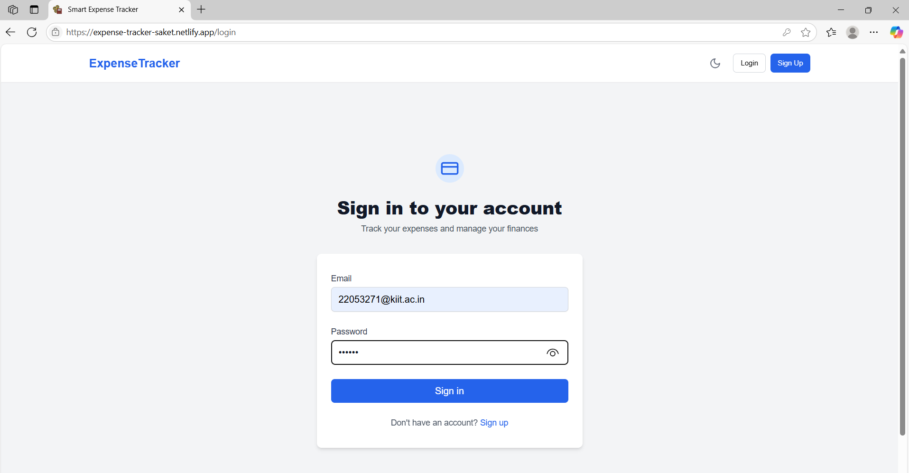
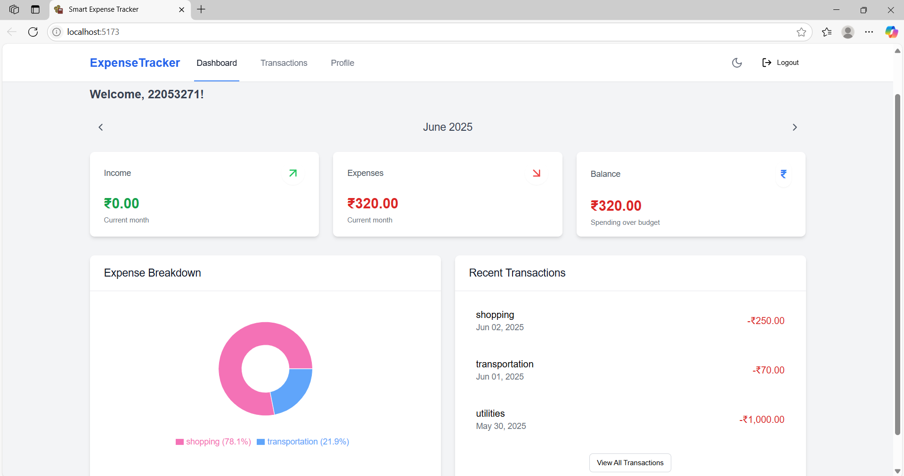
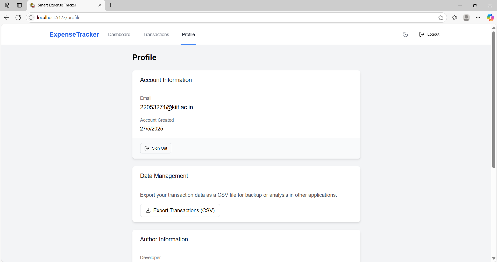
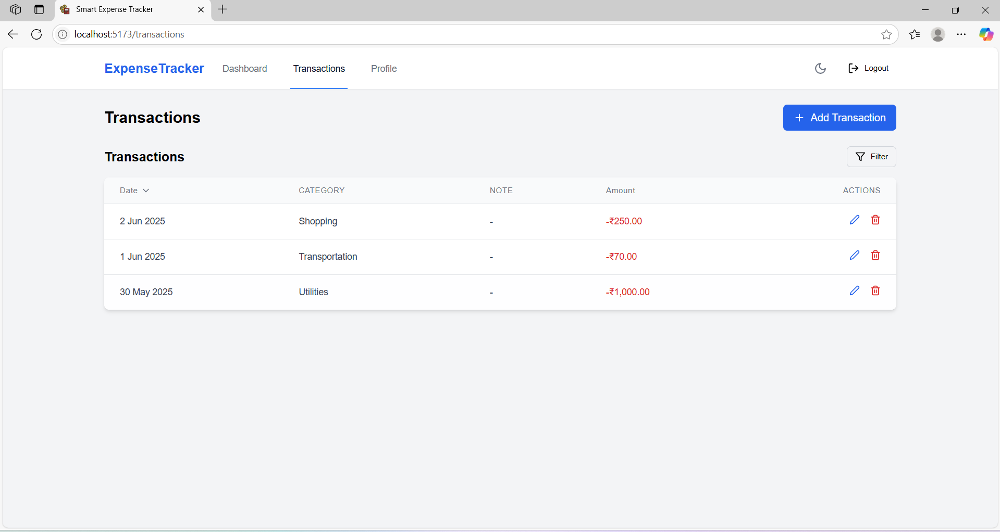
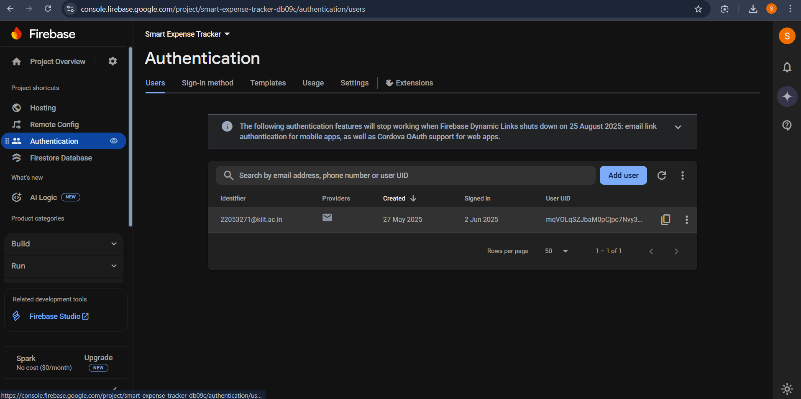
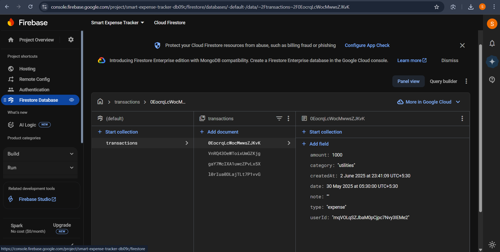
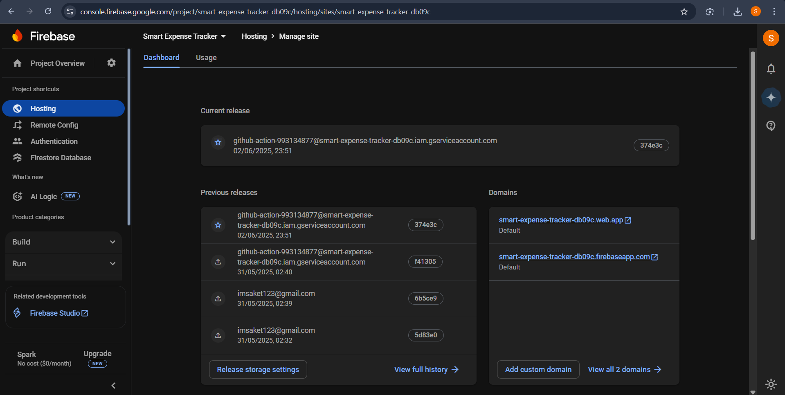

```mermaid
flowchart TD
    %% User and Browser
    User["User"]:::external
    Browser["Browser (Client)"]:::external
    User -->|"interacts"| Browser

    %% React Application
    subgraph "React Application" 
        direction TB
        Router["Routing Layer\n(src/App.tsx)"]:::frontend
        ProtectedRoute["ProtectedRoute HOC\n(Guard)"]:::frontend
        AuthForm["AuthForm\n(src/components/auth/AuthForm.tsx)"]:::frontend
        Navbar["Navbar\n(src/components/layout/Navbar.tsx)"]:::frontend
        SummaryCard["SummaryCard\n(src/components/dashboard/SummaryCard.tsx)"]:::frontend
        ExpenseChart["ExpenseChart\n(src/components/dashboard/ExpenseChart.tsx)"]:::frontend
        TransactionForm["TransactionForm\n(src/components/transactions/TransactionForm.tsx)"]:::frontend
        TransactionList["TransactionList\n(src/components/transactions/TransactionList.tsx)"]:::frontend
        Button["Button\n(src/components/ui/Button.tsx)"]:::frontend
        CardUI["Card UI\n(src/components/ui/Card.tsx)"]:::frontend

        DashboardPage["DashboardPage\n(src/pages/DashboardPage.tsx)"]:::frontend
        LoginPage["LoginPage\n(src/pages/LoginPage.tsx)"]:::frontend
        RegisterPage["RegisterPage\n(src/pages/RegisterPage.tsx)"]:::frontend
        ProfilePage["ProfilePage\n(src/pages/ProfilePage.tsx)"]:::frontend
        TransactionsPage["TransactionsPage\n(src/pages/TransactionsPage.tsx)"]:::frontend

        subgraph "Contexts"
            direction TB
            AuthContextNode["AuthContext\n(src/contexts/AuthContext.tsx)"]:::state
            TransactionContextNode["TransactionContext\n(src/contexts/TransactionContext.tsx)"]:::state
            ThemeContextNode["ThemeContext\n(src/contexts/ThemeContext.tsx)"]:::state
        end

        subgraph "Utils & Types"
            Formatters["Formatters\n(src/utils/formatters.ts)"]:::utility
            Types["Types\n(src/types/index.ts)"]:::utility
        end

        Main["App Entry\n(src/main.tsx)"]:::frontend
        ViteConfig["Vite Config\n(vite.config.ts)"]:::utility
        EnvTypes["Env Types\n(src/vite-env.d.ts)"]:::utility
        TailwindConfig["Tailwind Config\n(tailwind.config.js)"]:::utility
        Postcss["PostCSS Config\n(postcss.config.js)"]:::utility
        IndexCSS["Global CSS\n(src/index.css)"]:::utility

        Browser -->|"loads"| Main
        Main -->|wraps| AuthContextNode
        Main -->|wraps| TransactionContextNode
        Main -->|wraps| ThemeContextNode
        Main -->|uses| Router
        Router -->|routes| LoginPage
        Router -->|routes| RegisterPage
        Router -->|routes| DashboardPage
        Router -->|routes| ProfilePage
        Router -->|routes| TransactionsPage

        DashboardPage -->|"uses"| Navbar
        DashboardPage -->|"uses"| SummaryCard
        DashboardPage -->|"uses"| ExpenseChart

        TransactionsPage -->|"uses"| TransactionForm
        TransactionsPage -->|"uses"| TransactionList

        LoginPage -->|"uses"| AuthForm
        RegisterPage -->|"uses"| AuthForm

        AuthContextNode -->|"provides auth state"| ProtectedRoute
        ProtectedRoute -->|guards| DashboardPage
        ProtectedRoute -->|guards| ProfilePage
        ProtectedRoute -->|guards| TransactionsPage

        AuthForm -->|"dispatches actions"| AuthContextNode
        TransactionForm -->|"dispatches actions"| TransactionContextNode
        TransactionList -->|"listens to updates"| TransactionContextNode

        Formatters -->|helper| DashboardPage
        Types -->|types| DashboardPage
        Types -->|types| TransactionForm

        ViteConfig -->|configures| Main
        EnvTypes -->|types| Main
        TailwindConfig -->|styles| Main
        Postcss -->|styles| Main
        IndexCSS -->|styles| Main
    end

    %% Firebase BaaS
    subgraph "Firebase BaaS" 
        direction TB
        FirebaseInit["Firebase SDK Init\n(src/firebase/config.ts)"]:::service
        FirebaseAuth["Firebase Authentication"]:::service
        FirestoreDB["Firestore Database"]:::service
    end

    Main -->|"initializes"| FirebaseInit
    FirebaseInit --> FirebaseAuth
    FirebaseInit --> FirestoreDB

    AuthContextNode -->|"calls SDK"| FirebaseAuth
    TransactionContextNode -->|"calls SDK"| FirestoreDB
    FirestoreDB -- real-time updates --> TransactionContextNode

    %% CI/CD Pipeline
    subgraph "CI/CD & Hosting"
        direction TB
        WorkflowMerge["GitHub Action\n(firebase-hosting-merge.yml)"]:::pipeline
        WorkflowPR["GitHub Action\n(firebase-hosting-pull-request.yml)"]:::pipeline
        BuildDir["Build Output\n(build/)"]:::pipeline
        HTMLIndex["Index HTML\n(index.html)"]:::pipeline
        HTML404["404 Page\n(public/404.html)"]:::pipeline
        FirebaseJSON["firebase.json"]:::pipeline
        Firebaserc[".firebaserc"]:::pipeline
        Hosting["Firebase Hosting"]:::service
    end

    WorkflowMerge -->|on merge| BuildDir
    WorkflowPR -->|on PR| BuildDir
    BuildDir -->|deploy| Hosting
    HTMLIndex -->|served by| Hosting
    HTML404 -->|served by| Hosting
    FirebaseJSON -->|config| Hosting
    Firebaserc -->|config| Hosting

    %% Click Events
    click Router "https://github.com/sinha-19/smart-expense-tracker/blob/master/src/App.tsx"
    click ProtectedRoute "https://github.com/sinha-19/smart-expense-tracker/blob/master/src/components/utils/ProtectedRoute.tsx"
    click AuthForm "https://github.com/sinha-19/smart-expense-tracker/blob/master/src/components/auth/AuthForm.tsx"
    click Navbar "https://github.com/sinha-19/smart-expense-tracker/blob/master/src/components/layout/Navbar.tsx"
    click SummaryCard "https://github.com/sinha-19/smart-expense-tracker/blob/master/src/components/dashboard/SummaryCard.tsx"
    click ExpenseChart "https://github.com/sinha-19/smart-expense-tracker/blob/master/src/components/dashboard/ExpenseChart.tsx"
    click TransactionForm "https://github.com/sinha-19/smart-expense-tracker/blob/master/src/components/transactions/TransactionForm.tsx"
    click TransactionList "https://github.com/sinha-19/smart-expense-tracker/blob/master/src/components/transactions/TransactionList.tsx"
    click Button "https://github.com/sinha-19/smart-expense-tracker/blob/master/src/components/ui/Button.tsx"
    click CardUI "https://github.com/sinha-19/smart-expense-tracker/blob/master/src/components/ui/Card.tsx"
    click AuthContextNode "https://github.com/sinha-19/smart-expense-tracker/blob/master/src/contexts/AuthContext.tsx"
    click TransactionContextNode "https://github.com/sinha-19/smart-expense-tracker/blob/master/src/contexts/TransactionContext.tsx"
    click ThemeContextNode "https://github.com/sinha-19/smart-expense-tracker/blob/master/src/contexts/ThemeContext.tsx"
    click FirebaseInit "https://github.com/sinha-19/smart-expense-tracker/blob/master/src/firebase/config.ts"
    click DashboardPage "https://github.com/sinha-19/smart-expense-tracker/blob/master/src/pages/DashboardPage.tsx"
    click LoginPage "https://github.com/sinha-19/smart-expense-tracker/blob/master/src/pages/LoginPage.tsx"
    click RegisterPage "https://github.com/sinha-19/smart-expense-tracker/blob/master/src/pages/RegisterPage.tsx"
    click ProfilePage "https://github.com/sinha-19/smart-expense-tracker/blob/master/src/pages/ProfilePage.tsx"
    click TransactionsPage "https://github.com/sinha-19/smart-expense-tracker/blob/master/src/pages/TransactionsPage.tsx"
    click Formatters "https://github.com/sinha-19/smart-expense-tracker/blob/master/src/utils/formatters.ts"
    click Types "https://github.com/sinha-19/smart-expense-tracker/blob/master/src/types/index.ts"
    click Main "https://github.com/sinha-19/smart-expense-tracker/blob/master/src/main.tsx"
    click ViteConfig "https://github.com/sinha-19/smart-expense-tracker/blob/master/vite.config.ts"
    click EnvTypes "https://github.com/sinha-19/smart-expense-tracker/blob/master/src/vite-env.d.ts"
    click TailwindConfig "https://github.com/sinha-19/smart-expense-tracker/blob/master/tailwind.config.js"
    click Postcss "https://github.com/sinha-19/smart-expense-tracker/blob/master/postcss.config.js"
    click IndexCSS "https://github.com/sinha-19/smart-expense-tracker/blob/master/src/index.css"
    click WorkflowMerge "https://github.com/sinha-19/smart-expense-tracker/blob/master/.github/workflows/firebase-hosting-merge.yml"
    click WorkflowPR "https://github.com/sinha-19/smart-expense-tracker/blob/master/.github/workflows/firebase-hosting-pull-request.yml"
    click FirebaseJSON "https://github.com/sinha-19/smart-expense-tracker/blob/master/firebase.json"
    click Firebaserc "https://github.com/sinha-19/smart-expense-tracker/blob/master/.firebaserc"
    click HTMLIndex "https://github.com/sinha-19/smart-expense-tracker/blob/master/index.html"
    click HTML404 "https://github.com/sinha-19/smart-expense-tracker/blob/master/public/404.html"
    click BuildDir "https://github.com/sinha-19/smart-expense-tracker/tree/master/build/"

    %% Styles
    classDef frontend fill:#D0E6FF,stroke:#0366d6,color:#0366d6
    classDef state fill:#E6FFEA,stroke:#28A745,color:#28A745
    classDef utility fill:#FFF8E1,stroke:#FFC107,color:#FFC107
    classDef service fill:#FFEFEF,stroke:#DC3545,color:#DC3545
    classDef pipeline fill:#F0F0F0,stroke:#6C757D,color:#6C757D
    classDef external fill:#E8F0FE,stroke:#3367D6,color:#3367D6
```

# Smart Expense Tracker (React + Firebase + TypeScript)

A **Smart Expense Tracker** web app designed for real-world personal finance management with a modern, responsive UI tailored for Indian users. Built using **React.js**, **TypeScript**, **Firebase** (Authentication & Firestore), **Tailwind CSS**, and **Recharts**. Effortlessly track your income and expenses with real-time sync, beautiful analytics, and seamless user experience.

**Live Demo:**  
👉 [expense-tracker-saket.netlify.app](https://expense-tracker-saket.netlify.app)

---

## 🚀 Overview

Smart Expense Tracker empowers users to:
- Securely log in and manage their own expenses and income.
- Instantly see insights and trends with interactive charts.
- Add, edit, and delete transactions, with all data safely stored in the cloud.
- Enjoy a mobile-first, dark-mode enabled, and visually appealing experience.
- Export transaction records for offline analysis.

Designed for simplicity, speed, and clarity, the app is built to be both beginner-friendly and production-ready, with a focus on Indian currency formatting and localized experience.

---

## 🛠️ Tech Stack

- **Frontend:** React.js (with TypeScript)
- **Backend-as-a-Service:** Firebase (Authentication & Firestore)
- **Styling:** Tailwind CSS
- **Data Visualization:** Recharts
- **Routing:** React Router
- **State Management:** React Context API

---

## 🏗️ Project Structure & Architecture

```
src/
│
├── components/         # Modular UI building blocks
│   ├── auth/           # Login/Register forms
│   ├── dashboard/      # Dashboard cards, charts, analytics
│   ├── layout/         # Navbar, Footer, Layout wrappers
│   ├── transactions/   # Transaction form & transaction list
│   ├── ui/             # Buttons, toggles, dialogs, etc.
│   └── utils/          # Higher-order components, guards
│
├── contexts/           # Auth, Theme, Transaction Contexts
├── firebase/           # Firebase config & integration
├── pages/              # Main app pages (Dashboard, Profile, Analytics)
├── types/              # Shared TypeScript types/interfaces
├── utils/              # Formatters, helpers, data utilities
├── App.tsx             # App entry, routes, global providers
└── main.tsx            # Bootstrap & render root app
```

### Modular & Scalable Architecture

- **Component-Driven:** UI is broken into small, manageable, and reusable pieces.
- **Context-Based State:** Auth, user, and transaction data use React Context for easy and global state sharing.
- **Full Firebase Integration:** Secure, real-time CRUD operations with Firestore for transactions; Auth for user handling.
- **Responsive Design:** Layouts adapt seamlessly from desktop to mobile, and light to dark mode.
- **Data Visualization:** Analytics are instantly updated with every transaction using Recharts.

---

## 🌟 Key Features

### 1. **User Authentication**
- **Sign Up, Login, Logout:** Secure and fast, powered by Firebase Auth (Email/Password)
- **User Data Isolation:** Each user's transactions are private and stored separately

### 2. **Transaction Management**
- **Add Income/Expense:** Simple form for recording transactions with amount, type, category, note, and date
- **Edit/Delete:** Update or remove transactions anytime
- **Cloud Sync:** All data stored in Firestore, instantly synced across devices

### 3. **Dashboard & Analytics**
- **Overview Cards:** Quick view of income, expenses, and balance for the current month
- **Charts:** Category-wise expense visuals (Pie & Bar charts with Recharts)
- **Recent Transactions:** List of latest activity for quick review

### 4. **Export & Utilities**
- **Export as CSV:** Download your transaction history for offline use
- **(Planned) Export as PDF:** Coming soon!

### 5. **Localization & UI**
- **Indian Rupee (₹):** All values formatted with Indian numbering system
- **Modern UI/UX:** Clean, card-based layout with [Poppins](https://fonts.google.com/specimen/Poppins) font
- **Responsive & Accessible:** Works beautifully on all devices
- **Dark Mode:** Toggle between light and dark themes

---

## 🔐 Firestore Database Structure

```
users (collection)
│
└── {userId} (document)
    │
    └── transactions (subcollection)
         │
         └── {transactionId} (document)
              ├── amount: number
              ├── type: "income" | "expense"
              ├── category: string
              ├── note: string (optional)
              └── timestamp: Firestore timestamp
```

- Each user's data is private, secure, and only accessible after authentication.

---

## 🖼️ Screenshots

Below are real screenshots showing different parts and features of the application:

|  |  |  |
|:-------------------:|:-------------------:|:-------------------:|
|  |  |  |
|                     |
|  |

*Images represent login, dashboard, analytics, add/edit transaction, and other major UI sections.*

---

## ✨ User Flow

1. **Authentication:**  
   New users register or existing users log in. Auth state is managed globally.

2. **Dashboard:**  
   Users are greeted with a summary of their monthly financial activity and visual analytics.

3. **Add/Edit Transactions:**  
   Users create or update transactions (income/expense). Data is validated and written to Firestore.

4. **View & Manage Transactions:**  
   All transactions are listed by date, with options to edit or delete. Charts update live.

5. **Analytics:**  
   Explore category-wise breakdowns and trends in income and spending.

6. **Export Data:**  
   Users can download their transactions as CSV for records or tax purposes.

7. **Settings/Profile:**  
   Update personal info, toggle dark mode, and view author credits.

---

## 🛠️ Setup & Installation

1. **Clone Repository**
   ```bash
   git clone https://github.com/sinha-19/smart-expense-tracker.git
   cd smart-expense-tracker
   ```

2. **Install Dependencies**
   ```bash
   npm install
   ```

3. **Configure Firebase**
   - Create a project in [Firebase Console](https://console.firebase.google.com/)
   - Enable **Authentication** (Email/Password) and **Firestore Database**
   - Copy your Firebase config to `src/firebase/config.ts`:

     ```typescript
     // src/firebase/config.ts
     import { initializeApp, getApps } from "firebase/app";
     import { getAuth } from "firebase/auth";
     import { getFirestore } from "firebase/firestore";

     const firebaseConfig = {
       apiKey: "...",
       authDomain: "...",
       projectId: "...",
       storageBucket: "...",
       messagingSenderId: "...",
       appId: "..."
     };

     const app = getApps().length === 0 ? initializeApp(firebaseConfig) : getApps()[0];

     export const auth = getAuth(app);
     export const db = getFirestore(app);
     ```

4. **Start Development Server**
   ```bash
   npm run dev
   ```

5. **Open App**
   - Visit [http://localhost:5173](http://localhost:5173) or the URL shown in your terminal.

---

## 👨‍💻 Author & Credits

Made with ❤️ by **Saket Kumar Sinha**  
**Email:** imsaket123@gmail.com  
**GitHub:** [sinha-19](https://github.com/sinha-19)  
**Year:** © 2025

---

## 📝 License

This project is open source and free to use for learning and personal use.  
**© 2025 Saket Kumar Sinha. All rights reserved.**

---

## 🤝 Contributing

Beginners welcome!  
- Fork the repo, create a feature branch, and submit a pull request.
- Open issues for bugs, ideas, or questions.

---

## 🙏 Acknowledgements

- [Firebase](https://firebase.google.com/)
- [Tailwind CSS](https://tailwindcss.com/)
- [Recharts](https://recharts.org/)
- [React Router](https://reactrouter.com/)
- [Poppins Font](https://fonts.google.com/specimen/Poppins)

---

## 📚 Why This Project Shines

- **Full-Stack, Real-Time:** Modern React frontend with real-time Firebase backend.
- **Type Safety:** 100% TypeScript for safer, more maintainable code.
- **Indian-first UX:** All currency is ₹, with Indian number formats and date styles.
- **Analytics at a Glance:** Instantly see where your money goes.
- **Modern, Mobile-Ready:** Responsive, beautiful, and dark-mode enabled.
- **Beginner-Friendly:** Clean folder structure, clear code comments, and extensible design.

---

**⭐️ If you like this project, please star the repo and share it!**  
**Live Demo:** [expense-tracker-saket.netlify.app](https://expense-tracker-saket.netlify.app)

---

## 🗺️ Workflow Diagram


